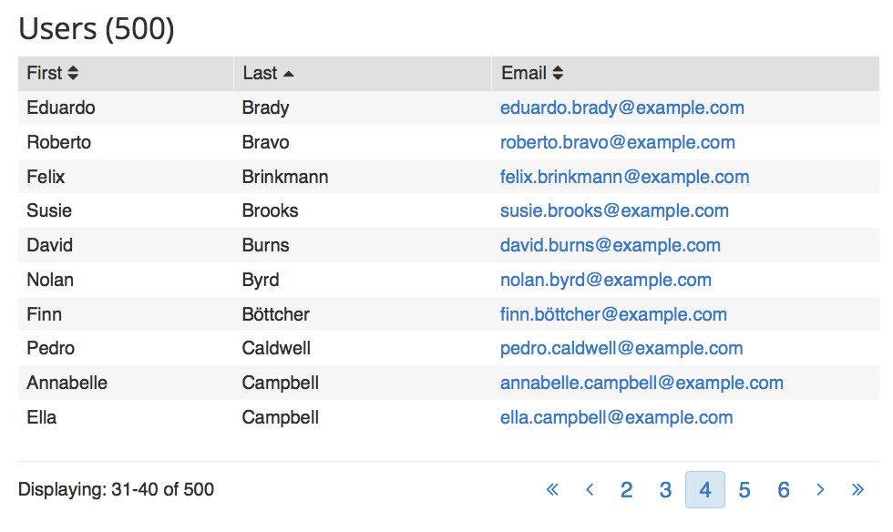

# redux-sample
Based on front-end sample requirements below

run `parcel client/index.html` to build and serve

# Front-End Sample
Sample project for evaling front-end development techniques and skills.

## Goal:
Create client side JavaScript app that lists 500 users in a table.
Visual look is optional, can use default HTML styling.

Example:

----

## Step 1

### Data
- The data should be loaded once per page load via AJAX from [https://randomuser.me](https://randomuser.me)

### Table
- Display the user's first name, last name, and email address in each column.
- Clicking the user's email will open an email client.

## Step 2

#### Pagination
- The table should show only 10 users at a time.
- There should be a page indicator below the table showing which users are visible
- There should be controls below the table to go to next page, previous page, etc
	- If there is no previous or next page, the links should be hidden or disabled.

## Step 3

#### Sorting
- The table should be sortable by each column.
- The table header should show which column is currently sorted by, and direction.
- Clicking on a new column will sort the new column ascending.
- Clicking on the currently sorted column will reverse the sort direction.

## Step 4

- Add unit tests for important logic above.
